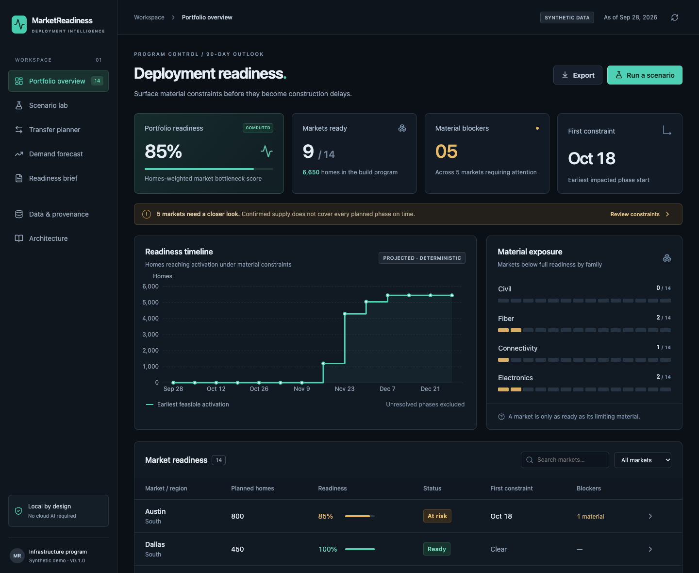
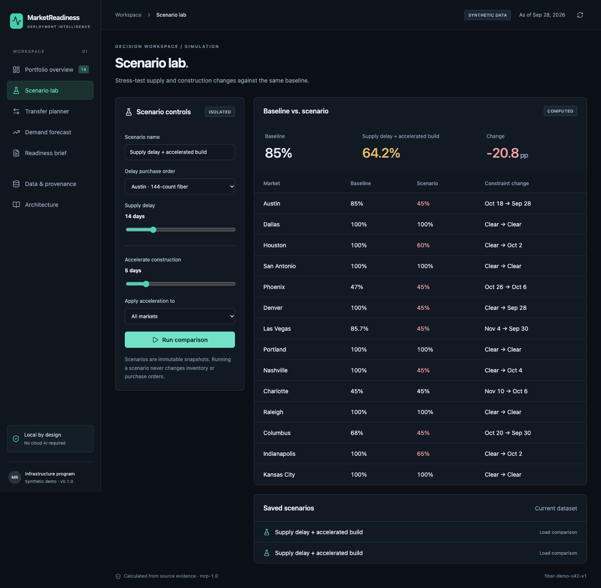
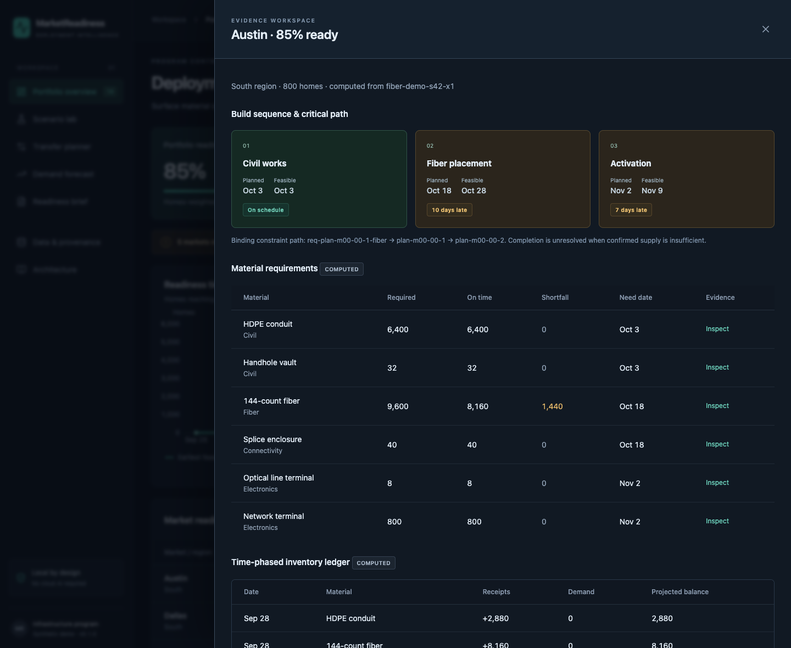
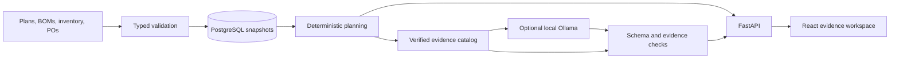

<div align="center">

# MarketReadiness AI

### Your inventory is healthy. Is your next build?

**Material-readiness prediction for infrastructure deployment programs.**

A local, open-source planning workspace that finds the wrong material in the wrong market **before it delays construction**.

[Quick start](#run-the-demo) · [Take the tour](#a-three-minute-operations-review) · [Measured results](#measured-not-promised) · [Architecture](#how-it-works) · [Contribute](CONTRIBUTING.md)

**Deterministic planning · Local AI · No paid APIs · Apache-2.0**

</div>



## The problem inventory totals miss

A fiber deployment program can own enough cable overall and still miss its next market launch. Some stock is reserved. Some is quarantined. An overdue PO is still shown as incoming. A supplier promise moved, but the construction sequence did not.

MarketReadiness turns those disconnected facts into operational questions with inspectable answers:

- **Which market becomes constrained first—and by which material?**
- **What happens if this PO slips two weeks while construction moves forward?**
- **Can another market help without creating a second shortage?**
- **What evidence supports the readiness brief?**

The sample program opens with **14 markets, 6,650 planned homes, 85.0% readiness, and 5 material blockers**. Those values are calculated from the committed seed-42 dataset, not hardcoded dashboard metrics.

## Run the demo

You need a Docker Engine with Compose v2. No model, paid account or API key is required. An open-source engine such as Docker Engine on Linux or Colima on macOS can run it; Docker Desktop is optional.

```bash
# After downloading or cloning this repository:
cd market-readiness-ai
cp .env.example .env
docker compose up --build
```

Open **[localhost:8080](http://localhost:8080)**. The API is at **[localhost:8000/docs](http://localhost:8000/docs)**. The database and sample data initialize automatically. The first build needs internet access for open-source packages and images; subsequent operation needs no external service.

**Verification status:** native backend, production frontend build, browser workflow, accessibility checks and a real local Ollama model have been exercised. Docker Engine was unavailable on the authoring machine. The supplied Compose smoke test and GitHub CI jobs remain release gates to run on a Docker host. See the [honest release checklist](docs/release-checklist.md).

```bash
# Verify a running Compose stack:
python scripts/smoke.py
# Stop containers, retaining the database:
docker compose down
```

[Native macOS / Windows setup](docs/development.md) · [Enable local Ollama](docs/ai-design.md) · [Troubleshooting](docs/development.md#troubleshooting)

## A three-minute operations review

1. **Open Austin.** The fiber commitment misses the planned October 18 start. Inspect the material requirement, source IDs and the delay propagated into activation.
2. **Compare Phoenix.** Quarantined fiber is unavailable. The eventual PO still does not fully cover the requirement, so the app exposes an unresolved completion instead of guessing a date.
3. **Run a scenario.** Delay a purchase order by 14 days and accelerate construction by 5. Compare scores and first-constraint dates against an unchanged baseline.
4. **Find a safe transfer.** Adjust transit time, protected safety stock and regional restrictions. Inspect the donor’s minimum remaining balance across the full horizon.
5. **Generate the weekly brief.** Every statement exposes its evidence. It works immediately without AI; optional local AI chooses the order of verified facts.

<details>
<summary>See the scenario workspace and evidence drawer</summary>





</details>

## What is actually implemented

| Capability | Behavior |
|---|---|
| Material requirements planning | BOM explosion, finite supply allocation, reserved/quarantined exclusions, partial receipts, supplier confirmations |
| Readiness by market / phase / family | Bottleneck coverage scores, homes-weighted portfolio score, dated material blockers |
| Critical path and timeline | Material gates and predecessor durations determine earliest feasible starts and activation |
| Scenario comparison | Immutable delayed-PO and accelerated-build scenarios; source dataset retained |
| Guarded transfers | Current-stock conservation, donor safety floors, transit deadlines, same-region and score restrictions |
| Consumption forecast | Interpretable weekday-mean baseline with held-out MAE/WAPE; never double-counted as BOM demand |
| Grounded readiness brief | Daily/weekly exact evidence rendering; optional local model selection, schema checks, abstention and fallback |
| Data and provenance | Typed JSON import, atomic acceptance, visible rejection reports, source IDs and lineage, paginated inspection |
| Integration API | Versioned REST, typed schemas, OpenAPI, read/write authorization boundaries, idempotent mutations |
| Usable analytics | Dark responsive workspace, search/filter, evidence drawers, CSV/brief exports, loading/empty/error states |

## How it works



**The technical boundary matters:** the model never calculates readiness, allocates stock, invents a constraint date, or changes a workflow state. Numerical outputs belong to deterministic code. The optional model returns allowlisted evidence IDs; the application renders the corresponding facts. Model failure cannot corrupt the plan.

- **Planning:** decimal-to-integer BOM quantities, FIFO reservations, conservative confirmed supply, event-based balances, binding dependency paths.
- **Data:** Pydantic schemas, atomic immutable snapshots, visible validation reports, content-addressed runs and transactional idempotency.
- **AI:** runtime protocol, schema-constrained Ollama adapter, source attribution, bounded retries, abstention and observable telemetry.
- **Evaluation:** exact synthetic oracles, held-out forecasting, donor conservation tests and real runtime measurements.

[Architecture and equations](docs/architecture.md) · [Data dictionary](docs/data-model.md) · [AI design](docs/ai-design.md) · [ADRs](docs/adr)

## Stack

Python 3.12+ · FastAPI · Pydantic · Polars · SQLAlchemy · PostgreSQL 17 · React 19 · TypeScript · Vite · ECharts · Ollama (optional) · Nginx · Docker Compose.

SQLite supports native development. Weekday-mean forecasting is an explicit baseline instead of an additional forecasting framework: [why](docs/adr/0002-forecast-baseline.md). Concrete implementations remain portable and open source.

## Sample data and API

The committed synthetic dataset is reproducible. Generate a larger one locally:

```bash
python -m marketreadiness.data.generator --seed 42 --scale 10 \
  --output data/generated/large.json
```

Inspect readiness or submit an isolated scenario:

```bash
curl http://localhost:8000/api/v1/portfolio

curl -X POST http://localhost:8000/api/v1/scenarios \
  -H 'Content-Type: application/json' \
  -H 'Idempotency-Key: example-fiber-delay-001' \
  -d '{"name":"Fiber delay + faster build","po_delays":{"po-m00-00-fiber":14},"accelerate_days":5}'

curl -X POST http://localhost:8000/api/v1/briefs \
  -H 'Content-Type: application/json' \
  -d '{"period":"weekly"}'
```

Use `Authorization: Bearer ...` in secured mode. Read-only queries, computed queries and persisted mutations are separate routers. Reusing an idempotency key with a different request returns a conflict. [API guide](docs/api.md).

## Measured, not promised

Example recorded **September 29, 2026 UTC** on **Apple M5, 16 GiB RAM, macOS arm64, Python 3.12.14**. Fixed seed 42, 90-day planning horizon, five timed warm runs; memory measured separately.

| Portfolio size | Source records | Median planning runtime | Python peak allocation |
|---|---:|---:|---:|
| 14 markets | 5,024 | **4.07 ms** | 3.02 MiB |
| 140 markets | 50,132 | **44.44 ms** | 30.26 MiB |

This times the planning function including result hashing, **not** the HTTP response, database, UI or model. Memory excludes native library/model allocations. [Raw JSON, CSV and complete methodology](docs/benchmarks/native-no-llm/summary.md).

| Reproducible evaluation | Observed result |
|---|---|
| Constraint date / no-constraint oracle | 14 / 14 synthetic cases matched |
| Readiness oracle error | 0 percentage points |
| Consumption forecast WAPE | 9.40% across 1,176 held-out observations |
| Transfer timing / safety-floor checks | 6 / 6 recommendations passed |
| Deterministic explanation grounding | 8 / 8 statements matched exact evidence |
| Local Qwen3-8B Q4_K_M briefing | 8 / 8 statements grounded; 13.92 s; no retries |

These are **synthetic regression results, not real-world forecast accuracy claims**. Explanation grounding is enforced by construction; model salience still needs evaluation. The local-model result is a single measured run with its model digest and runtime configuration recorded [here](docs/benchmarks/local-qwen3-8b/results.json).

Reproduce the benchmark:

```bash
python -m marketreadiness.evaluation.benchmark
# JSON + CSV + Markdown → artifacts/benchmark/
```

[Evaluation methodology](docs/evaluation.md) · [Tests](tests) · [CI workflow](.github/workflows/ci.yml)

## Limits worth understanding

- One program and one home cohort per market. Multi-tenant authorization and ERP connectors are not implemented.
- Requirements reserve material at phase start. Daily crew throughput, installation calendars, yield and substitutions are outside this model.
- Transfer recommendations use fixed transit time and guardrails; they are neither cost-optimal nor automatically executed.
- Readiness is a coverage measure, not a calibrated probability. A missing commitment can intentionally make the result conservative.
- Forecasts use a short synthetic history with weekly structure. They do not establish supplier reliability or probabilistic readiness.
- Immutable snapshots are loaded in memory. Large-scale incremental ingestion and online model training are not claimed.
- Docker/PostgreSQL validation and GitHub CI must be completed on a suitable host before calling this a verified container release.

## Security and privacy

The default demo is loopback-only and uses synthetic records. All core processing and optional inference stay local. There are no paid credentials, analytics trackers, external fonts, live ERP integrations or model-generated commands.

Imports are JSON-only, size-limited, schema-validated and atomic. State changes have server-side authorization in secured mode. The database has separate reader and writer identities in Compose. Public demo-only database passwords are intentionally unsuitable for shared deployment. Review the [threat model](docs/security.md) before adapting the application to real operations.

## The next five meaningful improvements

1. **Probabilistic supply readiness:** calibrated supplier lead-time distributions, confidence intervals and rolling-origin validation on real, appropriately licensed data.
2. **Cost-aware transfer optimization:** min-cost flow with freight capacity, donor risk budgets and service-level tradeoffs.
3. **Incremental event ingestion:** normalized material events, multiple project cohorts, reconciliation and replay instead of whole-snapshot replacement.
4. **Work-package execution model:** daily installation demand, labor calendars, material substitutions, scrap/yield and partial phase completion.
5. **Shared deployment controls:** scoped users, per-market authorization, background compute jobs, rate limits, migrations and operational SLOs.

[Roadmap and acceptance criteria](docs/roadmap.md)

## Contributing and reuse

Start with a reproducible domain case, an explicit invariant and a test. Supply planning practitioners can contribute failure cases and terminology without writing code. Engineers can extend local runtimes, improve ingestion or benchmark forecasting alternatives.

Read [CONTRIBUTING.md](CONTRIBUTING.md), [CODE_OF_CONDUCT.md](CODE_OF_CONDUCT.md), and [SECURITY.md](SECURITY.md). The application and synthetic data use [Apache-2.0](LICENSE). Dependencies and model weights retain their own licenses; see the [license inventory](docs/open-source-licenses.md).

If this helps your team reason about material constraints, share a reproducible case or build on it. Useful evidence is the best contribution.
